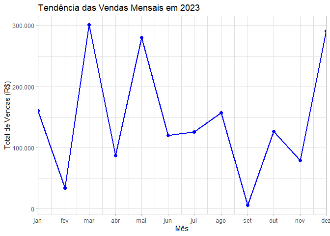

# Limpeza e Análise de Dados de Vendas

## Pacotes carregados:

    # Instala os pacotes necessários (se ainda não estiverem instalados)
    if (!require(dplyr)) install.packages("dplyr")

    ## Carregando pacotes exigidos: dplyr

    ## 
    ## Anexando pacote: 'dplyr'

    ## Os seguintes objetos são mascarados por 'package:stats':
    ## 
    ##     filter, lag

    ## Os seguintes objetos são mascarados por 'package:base':
    ## 
    ##     intersect, setdiff, setequal, union

    if (!require(tidyr)) install.packages("tidyr")

    ## Carregando pacotes exigidos: tidyr

    if (!require(ggplot2)) install.packages("ggplot2")

    ## Carregando pacotes exigidos: ggplot2

    if (!require(scales)) install.packages("scales")

    ## Carregando pacotes exigidos: scales

    # Carrega os pacotes
    library(dplyr)
    library(tidyr)
    library(ggplot2)

## Criação do script para simular um dataset de vendas:

    # Função para gerar dataset de vendas
    gerar_dados_vendas <- function(n = 50) {
      
      # Define a semente para reprodutibilidade
      set.seed(123)
      
      # Produtos, categorias e preços fixos
      produto_info <- data.frame(
        Produto = c("Notebook", "Smartphone", "Mouse", "Teclado", "Fone de Ouvido"),
        Categoria = c("Eletronicos", "Eletronicos", "Acessorios", "Acessorios", "Acessorios"),
        Preco = c(3500, 2000, 100, 150, 200)
      )
      
      # Cria os dados simulados
      dados_vendas <- data.frame(
        ID = 1:n,
        Data = sample(seq(as.Date("2023-01-01"), as.Date("2023-12-31"), by = "day"), n, replace = TRUE),
        Produto = sample(produto_info$Produto, n, replace = TRUE),
        Quantidade = sample(1:30, n, replace = TRUE)
      )
      
      # Associa categorias e preços ao dataset de vendas
      dados_vendas <- merge(dados_vendas, produto_info, by = "Produto", all.x = TRUE)
      
      # Introduz valores ausentes aleatórios
      dados_vendas[sample(1:n, 5), "Produto"] <- NA
      
      # Introduz duplicatas aleatórias
      duplicatas <- dados_vendas[sample(1:n, 3), ]
      dados_vendas <- rbind(dados_vendas, duplicatas)
      
      return(dados_vendas)
    }

    # Gera o dataset
    data_raw <- gerar_dados_vendas(100)

    # Visualiza o dataset
    print(data_raw)

    ##            Produto  ID       Data Quantidade   Categoria Preco
    ## 1   Fone de Ouvido  34 2023-11-26          6  Acessorios   200
    ## 2   Fone de Ouvido  73 2023-03-10         16  Acessorios   200
    ## 3   Fone de Ouvido  86 2023-07-18          3  Acessorios   200
    ## 4   Fone de Ouvido  12 2023-04-01         17  Acessorios   200
    ## 5   Fone de Ouvido  77 2023-03-30         27  Acessorios   200
    ## 6   Fone de Ouvido  90 2023-03-26         30  Acessorios   200
    ## 7   Fone de Ouvido   8 2023-09-01          6  Acessorios   200
    ## 8   Fone de Ouvido  62 2023-08-23         12  Acessorios   200
    ## 9   Fone de Ouvido  24 2023-07-30          5  Acessorios   200
    ## 10  Fone de Ouvido  55 2023-03-31         13  Acessorios   200
    ## 11  Fone de Ouvido  13 2023-09-13          5  Acessorios   200
    ## 12  Fone de Ouvido  18 2023-12-21         14  Acessorios   200
    ## 13  Fone de Ouvido  54 2023-02-10          2  Acessorios   200
    ## 14  Fone de Ouvido  72 2023-01-13         16  Acessorios   200
    ## 15  Fone de Ouvido  98 2023-04-08          9  Acessorios   200
    ## 16  Fone de Ouvido  48 2023-07-29         18  Acessorios   200
    ## 17  Fone de Ouvido  45 2023-03-17         21  Acessorios   200
    ## 18  Fone de Ouvido  76 2023-10-05         27  Acessorios   200
    ## 19  Fone de Ouvido  65 2023-02-08         10  Acessorios   200
    ## 20  Fone de Ouvido  44 2023-03-13          8  Acessorios   200
    ## 21  Fone de Ouvido  53 2023-10-04         17  Acessorios   200
    ## 22  Fone de Ouvido  56 2023-11-12         24  Acessorios   200
    ## 23  Fone de Ouvido  61 2023-09-19          5  Acessorios   200
    ## 24           Mouse  47 2023-05-21         20  Acessorios   100
    ## 25           Mouse  25 2023-03-19         21  Acessorios   100
    ## 26           Mouse  78 2023-01-25          3  Acessorios   100
    ## 27           Mouse   5 2023-04-28         26  Acessorios   100
    ## 28           Mouse  10 2023-06-02         30  Acessorios   100
    ## 29           Mouse   7 2023-08-17         20  Acessorios   100
    ## 30           Mouse  42 2023-10-17         28  Acessorios   100
    ## 31           Mouse  74 2023-08-31          3  Acessorios   100
    ## 32           Mouse  14 2023-07-16         25  Acessorios   100
    ## 33            <NA>  19 2023-11-24          1  Acessorios   100
    ## 34           Mouse  33 2023-09-20         10  Acessorios   100
    ## 35           Mouse  91 2023-06-14         30  Acessorios   100
    ## 36           Mouse  31 2023-02-01         13  Acessorios   100
    ## 37            <NA>  40 2023-06-15         21  Acessorios   100
    ## 38           Mouse  79 2023-10-18         29  Acessorios   100
    ## 39            <NA>   4 2023-11-02         21  Acessorios   100
    ## 40           Mouse 100 2023-08-02         29  Acessorios   100
    ## 41           Mouse  69 2023-11-02         10  Acessorios   100
    ## 42        Notebook  57 2023-08-11         17 Eletronicos  3500
    ## 43            <NA>  38 2023-11-05         16 Eletronicos  3500
    ## 44        Notebook  30 2023-05-23         21 Eletronicos  3500
    ## 45        Notebook  70 2023-02-03          6 Eletronicos  3500
    ## 46        Notebook   6 2023-10-26          9 Eletronicos  3500
    ## 47        Notebook  20 2023-01-26          2 Eletronicos  3500
    ## 48        Notebook  59 2023-04-26         18 Eletronicos  3500
    ## 49        Notebook  22 2023-05-17         10 Eletronicos  3500
    ## 50        Notebook  49 2023-12-19         29 Eletronicos  3500
    ## 51        Notebook  71 2023-01-04         28 Eletronicos  3500
    ## 52        Notebook  63 2023-03-27         25 Eletronicos  3500
    ## 53        Notebook  43 2023-03-10         21 Eletronicos  3500
    ## 54        Notebook  83 2023-04-20          2 Eletronicos  3500
    ## 55        Notebook  88 2023-05-31         29 Eletronicos  3500
    ## 56        Notebook  28 2023-12-25         23 Eletronicos  3500
    ## 57        Notebook   3 2023-07-14         28 Eletronicos  3500
    ## 58        Notebook  87 2023-03-08          9 Eletronicos  3500
    ## 59        Notebook  92 2023-05-16          9 Eletronicos  3500
    ## 60        Notebook  97 2023-08-24         12 Eletronicos  3500
    ## 61        Notebook  89 2023-12-01          7 Eletronicos  3500
    ## 62        Notebook  95 2023-06-27         22 Eletronicos  3500
    ## 63        Notebook  80 2023-10-13         23 Eletronicos  3500
    ## 64      Smartphone  21 2023-01-07          4 Eletronicos  2000
    ## 65      Smartphone  51 2023-06-02          1 Eletronicos  2000
    ## 66      Smartphone  67 2023-08-28          6 Eletronicos  2000
    ## 67      Smartphone  68 2023-07-28         10 Eletronicos  2000
    ## 68      Smartphone  60 2023-04-04          2 Eletronicos  2000
    ## 69      Smartphone  23 2023-09-11          1 Eletronicos  2000
    ## 70      Smartphone  58 2023-01-16          3 Eletronicos  2000
    ## 71      Smartphone  11 2023-03-31         29 Eletronicos  2000
    ## 72      Smartphone  64 2023-12-08         13 Eletronicos  2000
    ## 73      Smartphone  39 2023-08-12         17 Eletronicos  2000
    ## 74      Smartphone  75 2023-11-04          4 Eletronicos  2000
    ## 75      Smartphone  93 2023-02-20          4 Eletronicos  2000
    ## 76      Smartphone  94 2023-03-15          2 Eletronicos  2000
    ## 77      Smartphone  82 2023-05-01         16 Eletronicos  2000
    ## 78      Smartphone  96 2023-12-28         26 Eletronicos  2000
    ## 79      Smartphone  84 2023-06-07         15 Eletronicos  2000
    ## 80      Smartphone  46 2023-03-04          7 Eletronicos  2000
    ## 81      Smartphone  99 2023-11-26         28 Eletronicos  2000
    ## 82      Smartphone   9 2023-01-14         18 Eletronicos  2000
    ## 83            <NA>   1 2023-06-28         21  Acessorios   150
    ## 84         Teclado   2 2023-01-14          7  Acessorios   150
    ## 85         Teclado  16 2023-12-14          3  Acessorios   150
    ## 86         Teclado  17 2023-05-17         25  Acessorios   150
    ## 87         Teclado  35 2023-01-23          7  Acessorios   150
    ## 88         Teclado  32 2023-04-19         18  Acessorios   150
    ## 89         Teclado  85 2023-03-05         23  Acessorios   150
    ## 90         Teclado  29 2023-11-28         25  Acessorios   150
    ## 91         Teclado  26 2023-03-22         25  Acessorios   150
    ## 92         Teclado  36 2023-11-05         29  Acessorios   150
    ## 93         Teclado  37 2023-05-15          9  Acessorios   150
    ## 94         Teclado  50 2023-12-13         17  Acessorios   150
    ## 95         Teclado  81 2023-06-08          3  Acessorios   150
    ## 96         Teclado  27 2023-02-12          8  Acessorios   150
    ## 97         Teclado  15 2023-04-01         20  Acessorios   150
    ## 98         Teclado  41 2023-08-05         13  Acessorios   150
    ## 99         Teclado  52 2023-10-21          2  Acessorios   150
    ## 100        Teclado  66 2023-06-08         29  Acessorios   150
    ## 121 Fone de Ouvido  18 2023-12-21         14  Acessorios   200
    ## 981        Teclado  41 2023-08-05         13  Acessorios   150
    ## 211 Fone de Ouvido  53 2023-10-04         17  Acessorios   200

    # Salva o dataset como um arquivo CSV
    write.csv(data_raw, "data_raw.csv", row.names = FALSE)

## Limpeza dos dados:

    # Carrega os dados brutos
    dados_vendas <- read.csv("data_raw.csv")

    # Verifica a estrutura dos dados
    summary(dados_vendas)

    ##    Produto                ID             Data             Quantidade   
    ##  Length:103         Min.   :  1.00   Length:103         Min.   : 1.00  
    ##  Class :character   1st Qu.: 25.50   Class :character   1st Qu.: 7.00  
    ##  Mode  :character   Median : 50.00   Mode  :character   Median :16.00  
    ##                     Mean   : 50.12                      Mean   :15.06  
    ##                     3rd Qu.: 74.50                      3rd Qu.:23.00  
    ##                     Max.   :100.00                      Max.   :30.00  
    ##   Categoria             Preco     
    ##  Length:103         Min.   : 100  
    ##  Class :character   1st Qu.: 150  
    ##  Mode  :character   Median : 200  
    ##                     Mean   :1210  
    ##                     3rd Qu.:2000  
    ##                     Max.   :3500

    glimpse(dados_vendas)

    ## Rows: 103
    ## Columns: 6
    ## $ Produto    <chr> "Fone de Ouvido", "Fone de Ouvido", "Fone de Ouvido", "Fone…
    ## $ ID         <int> 34, 73, 86, 12, 77, 90, 8, 62, 24, 55, 13, 18, 54, 72, 98, …
    ## $ Data       <chr> "2023-11-26", "2023-03-10", "2023-07-18", "2023-04-01", "20…
    ## $ Quantidade <int> 6, 16, 3, 17, 27, 30, 6, 12, 5, 13, 5, 14, 2, 16, 9, 18, 21…
    ## $ Categoria  <chr> "Acessorios", "Acessorios", "Acessorios", "Acessorios", "Ac…
    ## $ Preco      <int> 200, 200, 200, 200, 200, 200, 200, 200, 200, 200, 200, 200,…

    # Verifica valores ausentes nas colunas
    colSums(is.na(dados_vendas))

    ##    Produto         ID       Data Quantidade  Categoria      Preco 
    ##          5          0          0          0          0          0

    # Remove valores ausentes
    dados_vendas_limpo <- dados_vendas[complete.cases(dados_vendas), ]

    # Remove duplicatas
    dados_vendas_limpo <- dados_vendas_limpo[!duplicated(dados_vendas_limpo), ]

    # Ordena o data frame, em ordem crescente, por data
    dados_vendas_limpo <- arrange(dados_vendas_limpo, dados_vendas_limpo$Data)

    # Visualiza o dataset limpo
    print(dados_vendas_limpo)

    ##           Produto  ID       Data Quantidade   Categoria Preco
    ## 1        Notebook  71 2023-01-04         28 Eletronicos  3500
    ## 2      Smartphone  21 2023-01-07          4 Eletronicos  2000
    ## 3  Fone de Ouvido  72 2023-01-13         16  Acessorios   200
    ## 4      Smartphone   9 2023-01-14         18 Eletronicos  2000
    ## 5         Teclado   2 2023-01-14          7  Acessorios   150
    ## 6      Smartphone  58 2023-01-16          3 Eletronicos  2000
    ## 7         Teclado  35 2023-01-23          7  Acessorios   150
    ## 8           Mouse  78 2023-01-25          3  Acessorios   100
    ## 9        Notebook  20 2023-01-26          2 Eletronicos  3500
    ## 10          Mouse  31 2023-02-01         13  Acessorios   100
    ## 11       Notebook  70 2023-02-03          6 Eletronicos  3500
    ## 12 Fone de Ouvido  65 2023-02-08         10  Acessorios   200
    ## 13 Fone de Ouvido  54 2023-02-10          2  Acessorios   200
    ## 14        Teclado  27 2023-02-12          8  Acessorios   150
    ## 15     Smartphone  93 2023-02-20          4 Eletronicos  2000
    ## 16     Smartphone  46 2023-03-04          7 Eletronicos  2000
    ## 17        Teclado  85 2023-03-05         23  Acessorios   150
    ## 18       Notebook  87 2023-03-08          9 Eletronicos  3500
    ## 19 Fone de Ouvido  73 2023-03-10         16  Acessorios   200
    ## 20       Notebook  43 2023-03-10         21 Eletronicos  3500
    ## 21 Fone de Ouvido  44 2023-03-13          8  Acessorios   200
    ## 22     Smartphone  94 2023-03-15          2 Eletronicos  2000
    ## 23 Fone de Ouvido  45 2023-03-17         21  Acessorios   200
    ## 24          Mouse  25 2023-03-19         21  Acessorios   100
    ## 25        Teclado  26 2023-03-22         25  Acessorios   150
    ## 26 Fone de Ouvido  90 2023-03-26         30  Acessorios   200
    ## 27       Notebook  63 2023-03-27         25 Eletronicos  3500
    ## 28 Fone de Ouvido  77 2023-03-30         27  Acessorios   200
    ## 29 Fone de Ouvido  55 2023-03-31         13  Acessorios   200
    ## 30     Smartphone  11 2023-03-31         29 Eletronicos  2000
    ## 31 Fone de Ouvido  12 2023-04-01         17  Acessorios   200
    ## 32        Teclado  15 2023-04-01         20  Acessorios   150
    ## 33     Smartphone  60 2023-04-04          2 Eletronicos  2000
    ## 34 Fone de Ouvido  98 2023-04-08          9  Acessorios   200
    ## 35        Teclado  32 2023-04-19         18  Acessorios   150
    ## 36       Notebook  83 2023-04-20          2 Eletronicos  3500
    ## 37       Notebook  59 2023-04-26         18 Eletronicos  3500
    ## 38          Mouse   5 2023-04-28         26  Acessorios   100
    ## 39     Smartphone  82 2023-05-01         16 Eletronicos  2000
    ## 40        Teclado  37 2023-05-15          9  Acessorios   150
    ## 41       Notebook  92 2023-05-16          9 Eletronicos  3500
    ## 42       Notebook  22 2023-05-17         10 Eletronicos  3500
    ## 43        Teclado  17 2023-05-17         25  Acessorios   150
    ## 44          Mouse  47 2023-05-21         20  Acessorios   100
    ## 45       Notebook  30 2023-05-23         21 Eletronicos  3500
    ## 46       Notebook  88 2023-05-31         29 Eletronicos  3500
    ## 47          Mouse  10 2023-06-02         30  Acessorios   100
    ## 48     Smartphone  51 2023-06-02          1 Eletronicos  2000
    ## 49     Smartphone  84 2023-06-07         15 Eletronicos  2000
    ## 50        Teclado  81 2023-06-08          3  Acessorios   150
    ## 51        Teclado  66 2023-06-08         29  Acessorios   150
    ## 52          Mouse  91 2023-06-14         30  Acessorios   100
    ## 53       Notebook  95 2023-06-27         22 Eletronicos  3500
    ## 54       Notebook   3 2023-07-14         28 Eletronicos  3500
    ## 55          Mouse  14 2023-07-16         25  Acessorios   100
    ## 56 Fone de Ouvido  86 2023-07-18          3  Acessorios   200
    ## 57     Smartphone  68 2023-07-28         10 Eletronicos  2000
    ## 58 Fone de Ouvido  48 2023-07-29         18  Acessorios   200
    ## 59 Fone de Ouvido  24 2023-07-30          5  Acessorios   200
    ## 60          Mouse 100 2023-08-02         29  Acessorios   100
    ## 61        Teclado  41 2023-08-05         13  Acessorios   150
    ## 62       Notebook  57 2023-08-11         17 Eletronicos  3500
    ## 63     Smartphone  39 2023-08-12         17 Eletronicos  2000
    ## 64          Mouse   7 2023-08-17         20  Acessorios   100
    ## 65 Fone de Ouvido  62 2023-08-23         12  Acessorios   200
    ## 66       Notebook  97 2023-08-24         12 Eletronicos  3500
    ## 67     Smartphone  67 2023-08-28          6 Eletronicos  2000
    ## 68          Mouse  74 2023-08-31          3  Acessorios   100
    ## 69 Fone de Ouvido   8 2023-09-01          6  Acessorios   200
    ## 70     Smartphone  23 2023-09-11          1 Eletronicos  2000
    ## 71 Fone de Ouvido  13 2023-09-13          5  Acessorios   200
    ## 72 Fone de Ouvido  61 2023-09-19          5  Acessorios   200
    ## 73          Mouse  33 2023-09-20         10  Acessorios   100
    ## 74 Fone de Ouvido  53 2023-10-04         17  Acessorios   200
    ## 75 Fone de Ouvido  76 2023-10-05         27  Acessorios   200
    ## 76       Notebook  80 2023-10-13         23 Eletronicos  3500
    ## 77          Mouse  42 2023-10-17         28  Acessorios   100
    ## 78          Mouse  79 2023-10-18         29  Acessorios   100
    ## 79        Teclado  52 2023-10-21          2  Acessorios   150
    ## 80       Notebook   6 2023-10-26          9 Eletronicos  3500
    ## 81          Mouse  69 2023-11-02         10  Acessorios   100
    ## 82     Smartphone  75 2023-11-04          4 Eletronicos  2000
    ## 83        Teclado  36 2023-11-05         29  Acessorios   150
    ## 84 Fone de Ouvido  56 2023-11-12         24  Acessorios   200
    ## 85 Fone de Ouvido  34 2023-11-26          6  Acessorios   200
    ## 86     Smartphone  99 2023-11-26         28 Eletronicos  2000
    ## 87        Teclado  29 2023-11-28         25  Acessorios   150
    ## 88       Notebook  89 2023-12-01          7 Eletronicos  3500
    ## 89     Smartphone  64 2023-12-08         13 Eletronicos  2000
    ## 90        Teclado  50 2023-12-13         17  Acessorios   150
    ## 91        Teclado  16 2023-12-14          3  Acessorios   150
    ## 92       Notebook  49 2023-12-19         29 Eletronicos  3500
    ## 93 Fone de Ouvido  18 2023-12-21         14  Acessorios   200
    ## 94       Notebook  28 2023-12-25         23 Eletronicos  3500
    ## 95     Smartphone  96 2023-12-28         26 Eletronicos  2000

    # Salva o dataset limpo
    write.csv(dados_vendas_limpo, "data_clean.csv", row.names = FALSE)

## Análise de dados de vendas:

    # Carrega os dados limpos
    dados_vendas_limpo <- read.csv("data_clean.csv")

    # Converte "Data" para Date
    dados_vendas_limpo$Data <- as.Date(dados_vendas_limpo$Data)

    # Calcula o total de vendas
    dados_vendas_limpo$Total <- dados_vendas_limpo$Quantidade * dados_vendas_limpo$Preco

    # Agrega o total por produto
    totais_por_produto <- dados_vendas_limpo %>%
      group_by(Produto) %>%
      summarise(
        Total_Quantidade = sum(Quantidade),
        Total_Vendas = sum(Total)
      ) %>% 
      arrange(desc(Total_Vendas))

    # Visualiza o calculo de vendas totais
    print(dados_vendas_limpo)

    ##           Produto  ID       Data Quantidade   Categoria Preco  Total
    ## 1        Notebook  71 2023-01-04         28 Eletronicos  3500  98000
    ## 2      Smartphone  21 2023-01-07          4 Eletronicos  2000   8000
    ## 3  Fone de Ouvido  72 2023-01-13         16  Acessorios   200   3200
    ## 4      Smartphone   9 2023-01-14         18 Eletronicos  2000  36000
    ## 5         Teclado   2 2023-01-14          7  Acessorios   150   1050
    ## 6      Smartphone  58 2023-01-16          3 Eletronicos  2000   6000
    ## 7         Teclado  35 2023-01-23          7  Acessorios   150   1050
    ## 8           Mouse  78 2023-01-25          3  Acessorios   100    300
    ## 9        Notebook  20 2023-01-26          2 Eletronicos  3500   7000
    ## 10          Mouse  31 2023-02-01         13  Acessorios   100   1300
    ## 11       Notebook  70 2023-02-03          6 Eletronicos  3500  21000
    ## 12 Fone de Ouvido  65 2023-02-08         10  Acessorios   200   2000
    ## 13 Fone de Ouvido  54 2023-02-10          2  Acessorios   200    400
    ## 14        Teclado  27 2023-02-12          8  Acessorios   150   1200
    ## 15     Smartphone  93 2023-02-20          4 Eletronicos  2000   8000
    ## 16     Smartphone  46 2023-03-04          7 Eletronicos  2000  14000
    ## 17        Teclado  85 2023-03-05         23  Acessorios   150   3450
    ## 18       Notebook  87 2023-03-08          9 Eletronicos  3500  31500
    ## 19 Fone de Ouvido  73 2023-03-10         16  Acessorios   200   3200
    ## 20       Notebook  43 2023-03-10         21 Eletronicos  3500  73500
    ## 21 Fone de Ouvido  44 2023-03-13          8  Acessorios   200   1600
    ## 22     Smartphone  94 2023-03-15          2 Eletronicos  2000   4000
    ## 23 Fone de Ouvido  45 2023-03-17         21  Acessorios   200   4200
    ## 24          Mouse  25 2023-03-19         21  Acessorios   100   2100
    ## 25        Teclado  26 2023-03-22         25  Acessorios   150   3750
    ## 26 Fone de Ouvido  90 2023-03-26         30  Acessorios   200   6000
    ## 27       Notebook  63 2023-03-27         25 Eletronicos  3500  87500
    ## 28 Fone de Ouvido  77 2023-03-30         27  Acessorios   200   5400
    ## 29 Fone de Ouvido  55 2023-03-31         13  Acessorios   200   2600
    ## 30     Smartphone  11 2023-03-31         29 Eletronicos  2000  58000
    ## 31 Fone de Ouvido  12 2023-04-01         17  Acessorios   200   3400
    ## 32        Teclado  15 2023-04-01         20  Acessorios   150   3000
    ## 33     Smartphone  60 2023-04-04          2 Eletronicos  2000   4000
    ## 34 Fone de Ouvido  98 2023-04-08          9  Acessorios   200   1800
    ## 35        Teclado  32 2023-04-19         18  Acessorios   150   2700
    ## 36       Notebook  83 2023-04-20          2 Eletronicos  3500   7000
    ## 37       Notebook  59 2023-04-26         18 Eletronicos  3500  63000
    ## 38          Mouse   5 2023-04-28         26  Acessorios   100   2600
    ## 39     Smartphone  82 2023-05-01         16 Eletronicos  2000  32000
    ## 40        Teclado  37 2023-05-15          9  Acessorios   150   1350
    ## 41       Notebook  92 2023-05-16          9 Eletronicos  3500  31500
    ## 42       Notebook  22 2023-05-17         10 Eletronicos  3500  35000
    ## 43        Teclado  17 2023-05-17         25  Acessorios   150   3750
    ## 44          Mouse  47 2023-05-21         20  Acessorios   100   2000
    ## 45       Notebook  30 2023-05-23         21 Eletronicos  3500  73500
    ## 46       Notebook  88 2023-05-31         29 Eletronicos  3500 101500
    ## 47          Mouse  10 2023-06-02         30  Acessorios   100   3000
    ## 48     Smartphone  51 2023-06-02          1 Eletronicos  2000   2000
    ## 49     Smartphone  84 2023-06-07         15 Eletronicos  2000  30000
    ## 50        Teclado  81 2023-06-08          3  Acessorios   150    450
    ## 51        Teclado  66 2023-06-08         29  Acessorios   150   4350
    ## 52          Mouse  91 2023-06-14         30  Acessorios   100   3000
    ## 53       Notebook  95 2023-06-27         22 Eletronicos  3500  77000
    ## 54       Notebook   3 2023-07-14         28 Eletronicos  3500  98000
    ## 55          Mouse  14 2023-07-16         25  Acessorios   100   2500
    ## 56 Fone de Ouvido  86 2023-07-18          3  Acessorios   200    600
    ## 57     Smartphone  68 2023-07-28         10 Eletronicos  2000  20000
    ## 58 Fone de Ouvido  48 2023-07-29         18  Acessorios   200   3600
    ## 59 Fone de Ouvido  24 2023-07-30          5  Acessorios   200   1000
    ## 60          Mouse 100 2023-08-02         29  Acessorios   100   2900
    ## 61        Teclado  41 2023-08-05         13  Acessorios   150   1950
    ## 62       Notebook  57 2023-08-11         17 Eletronicos  3500  59500
    ## 63     Smartphone  39 2023-08-12         17 Eletronicos  2000  34000
    ## 64          Mouse   7 2023-08-17         20  Acessorios   100   2000
    ## 65 Fone de Ouvido  62 2023-08-23         12  Acessorios   200   2400
    ## 66       Notebook  97 2023-08-24         12 Eletronicos  3500  42000
    ## 67     Smartphone  67 2023-08-28          6 Eletronicos  2000  12000
    ## 68          Mouse  74 2023-08-31          3  Acessorios   100    300
    ## 69 Fone de Ouvido   8 2023-09-01          6  Acessorios   200   1200
    ## 70     Smartphone  23 2023-09-11          1 Eletronicos  2000   2000
    ## 71 Fone de Ouvido  13 2023-09-13          5  Acessorios   200   1000
    ## 72 Fone de Ouvido  61 2023-09-19          5  Acessorios   200   1000
    ## 73          Mouse  33 2023-09-20         10  Acessorios   100   1000
    ## 74 Fone de Ouvido  53 2023-10-04         17  Acessorios   200   3400
    ## 75 Fone de Ouvido  76 2023-10-05         27  Acessorios   200   5400
    ## 76       Notebook  80 2023-10-13         23 Eletronicos  3500  80500
    ## 77          Mouse  42 2023-10-17         28  Acessorios   100   2800
    ## 78          Mouse  79 2023-10-18         29  Acessorios   100   2900
    ## 79        Teclado  52 2023-10-21          2  Acessorios   150    300
    ## 80       Notebook   6 2023-10-26          9 Eletronicos  3500  31500
    ## 81          Mouse  69 2023-11-02         10  Acessorios   100   1000
    ## 82     Smartphone  75 2023-11-04          4 Eletronicos  2000   8000
    ## 83        Teclado  36 2023-11-05         29  Acessorios   150   4350
    ## 84 Fone de Ouvido  56 2023-11-12         24  Acessorios   200   4800
    ## 85 Fone de Ouvido  34 2023-11-26          6  Acessorios   200   1200
    ## 86     Smartphone  99 2023-11-26         28 Eletronicos  2000  56000
    ## 87        Teclado  29 2023-11-28         25  Acessorios   150   3750
    ## 88       Notebook  89 2023-12-01          7 Eletronicos  3500  24500
    ## 89     Smartphone  64 2023-12-08         13 Eletronicos  2000  26000
    ## 90        Teclado  50 2023-12-13         17  Acessorios   150   2550
    ## 91        Teclado  16 2023-12-14          3  Acessorios   150    450
    ## 92       Notebook  49 2023-12-19         29 Eletronicos  3500 101500
    ## 93 Fone de Ouvido  18 2023-12-21         14  Acessorios   200   2800
    ## 94       Notebook  28 2023-12-25         23 Eletronicos  3500  80500
    ## 95     Smartphone  96 2023-12-28         26 Eletronicos  2000  52000

    # Visualiza os totais por produto
    print(totais_por_produto)

    ## # A tibble: 5 × 3
    ##   Produto        Total_Quantidade Total_Vendas
    ##   <chr>                     <int>        <int>
    ## 1 Notebook                    350      1225000
    ## 2 Smartphone                  206       412000
    ## 3 Fone de Ouvido              311        62200
    ## 4 Teclado                     263        39450
    ## 5 Mouse                       297        29700

# Análise Exploratória de Dados de Vendas

    # Agrega os dados por mês
    dados_mensais <- dados_vendas_limpo %>%
      mutate(Mes = format(Data, "%Y-%m")) %>%
      group_by(Mes) %>%
      summarise(Total_Vendas_Mes = sum(Total)) %>%
      arrange(Mes)

    # Converte Mes novamente para Date
    dados_mensais$Mes <- as.Date(paste0(dados_mensais$Mes, "-01"))

    # Cria o gráfico de linha
    ggplot(dados_mensais, aes(x = Mes, y = Total_Vendas_Mes)) +
      geom_line(color = "blue", size = 1) +
      geom_point(color = "blue", size = 2) +
      scale_x_date(
        date_labels = "%b",
        date_breaks = "1 month",
        expand = c(0, 0)
      ) +
      scale_y_continuous(labels = label_number(big.mark = ".", decimal.mark = ",")) +
      labs(
        title = "Tendência das Vendas Mensais em 2023",
        x = "Mês",
        y = "Total de Vendas (R$)"
      ) +
      theme_light()

    ## Warning: Using `size` aesthetic for lines was deprecated in ggplot2 3.4.0.
    ## ℹ Please use `linewidth` instead.
    ## This warning is displayed once every 8 hours.
    ## Call `lifecycle::last_lifecycle_warnings()` to see where this warning was
    ## generated.

