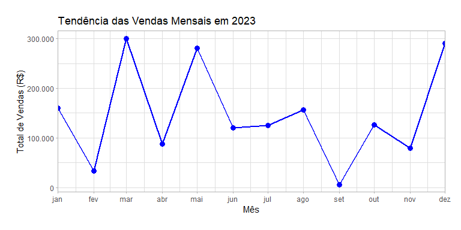
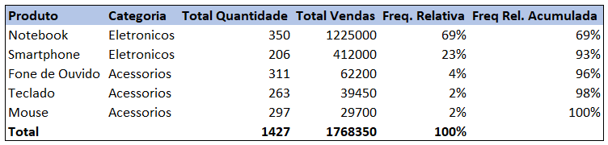
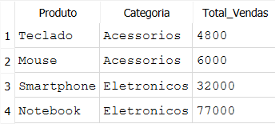

# Relatório / Insights

Rodrigo Felisberto  
24/11/2024

# Parte 1: Programação em R

## 1. Limpeza e Análise de Dados de Vendas

### Pacotes carregados:

``` r
# Instala os pacotes necessários (se ainda não estiverem instalados)
if (!require(dplyr)) install.packages("dplyr")
if (!require(ggplot2)) install.packages("ggplot2")
if (!require(scales)) install.packages("scales")
if (!require(grid)) install.packages("grid")

# Carrega os pacotes
library(dplyr) # Usado na manipulação de transformação de dados
library(ggplot2) # Usado para a criação do gráfico
library(scales) # Usado para formatar o eixo y do gráfico
library(grid) # Usado para aumentar as margens do gráfico
```

### Criação do script para simular um dataset de vendas:

``` r
# Função para gerar dataset de vendas
gerar_dados_vendas <- function(n = 50) {
  
  # Define a semente para reprodutibilidade
  set.seed(123)
  
  # Produtos, categorias e preços fixos
  produto_info <- data.frame(
    Produto = c("Notebook", "Smartphone", "Mouse", "Teclado", "Fone de Ouvido"),
    Categoria = c("Eletronicos", "Eletronicos", "Acessorios", "Acessorios", "Acessorios"),
    Preco = c(3500, 2000, 100, 150, 200)
  )
  
  # Cria os dados simulados
  dados_vendas <- data.frame(
    ID = 1:n,
    Data = sample(seq(as.Date("2023-01-01"), as.Date("2023-12-31"), by = "day"), n, replace = TRUE),
    Produto = sample(produto_info$Produto, n, replace = TRUE),
    Quantidade = sample(1:30, n, replace = TRUE)
  )
  
  # Associa categorias e preços ao dataset de vendas
  dados_vendas <- merge(dados_vendas, produto_info, by = "Produto", all.x = TRUE)
  
  # Introduz valores ausentes aleatórios
  dados_vendas[sample(1:n, 5), "Produto"] <- NA
  
  # Introduz duplicatas aleatórias
  duplicatas <- dados_vendas[sample(1:n, 3), ]
  dados_vendas <- rbind(dados_vendas, duplicatas)
  
  return(dados_vendas)
}

# Gera o dataset
data_raw <- gerar_dados_vendas(100)

# Salva o dataset como um arquivo CSV
write.csv(data_raw, "data_raw.csv", row.names = FALSE)
```

#### Primeiras 5 linhas do dataset:

``` r
head(data_raw, 5)
```

    ##          Produto ID       Data Quantidade  Categoria Preco
    ## 1 Fone de Ouvido 34 2023-11-26          6 Acessorios   200
    ## 2 Fone de Ouvido 73 2023-03-10         16 Acessorios   200
    ## 3 Fone de Ouvido 86 2023-07-18          3 Acessorios   200
    ## 4 Fone de Ouvido 12 2023-04-01         17 Acessorios   200
    ## 5 Fone de Ouvido 77 2023-03-30         27 Acessorios   200

### Limpeza dos dados:

``` r
# Carrega os dados brutos
dados_vendas <- read.csv("data_raw.csv")

# Resumo das colunas
summary(dados_vendas)
```

    ##    Produto                ID             Data             Quantidade   
    ##  Length:103         Min.   :  1.00   Length:103         Min.   : 1.00  
    ##  Class :character   1st Qu.: 25.50   Class :character   1st Qu.: 7.00  
    ##  Mode  :character   Median : 50.00   Mode  :character   Median :16.00  
    ##                     Mean   : 50.12                      Mean   :15.06  
    ##                     3rd Qu.: 74.50                      3rd Qu.:23.00  
    ##                     Max.   :100.00                      Max.   :30.00  
    ##   Categoria             Preco     
    ##  Length:103         Min.   : 100  
    ##  Class :character   1st Qu.: 150  
    ##  Mode  :character   Median : 200  
    ##                     Mean   :1210  
    ##                     3rd Qu.:2000  
    ##                     Max.   :3500

``` r
# Verifica a estrutura dos dados
glimpse(dados_vendas)
```

    ## Rows: 103
    ## Columns: 6
    ## $ Produto    <chr> "Fone de Ouvido", "Fone de Ouvido", "Fone de Ouvido", "Fone…
    ## $ ID         <int> 34, 73, 86, 12, 77, 90, 8, 62, 24, 55, 13, 18, 54, 72, 98, …
    ## $ Data       <chr> "2023-11-26", "2023-03-10", "2023-07-18", "2023-04-01", "20…
    ## $ Quantidade <int> 6, 16, 3, 17, 27, 30, 6, 12, 5, 13, 5, 14, 2, 16, 9, 18, 21…
    ## $ Categoria  <chr> "Acessorios", "Acessorios", "Acessorios", "Acessorios", "Ac…
    ## $ Preco      <int> 200, 200, 200, 200, 200, 200, 200, 200, 200, 200, 200, 200,…

``` r
# Verifica valores ausentes nas colunas
colSums(is.na(dados_vendas))
```

    ##    Produto         ID       Data Quantidade  Categoria      Preco 
    ##          5          0          0          0          0          0

``` r
# Remove valores ausentes
dados_vendas_limpo <- dados_vendas[complete.cases(dados_vendas), ]

# Remove duplicatas
dados_vendas_limpo <- dados_vendas_limpo[!duplicated(dados_vendas_limpo), ]

# Ordena o data frame, em ordem crescente, por data
dados_vendas_limpo <- arrange(dados_vendas_limpo, dados_vendas_limpo$Data)

# Salva o dataset limpo como um arquivo csv
write.csv(dados_vendas_limpo, "data_clean.csv", row.names = FALSE)
```

### Análise de dados de vendas:

``` r
# Carrega os dados limpos
dados_vendas_limpo <- read.csv("data_clean.csv")

# Converte "Data" para Date
dados_vendas_limpo$Data <- as.Date(dados_vendas_limpo$Data)

# Calcula o total de vendas
dados_vendas_limpo$Total <- dados_vendas_limpo$Quantidade * dados_vendas_limpo$Preco

# Agrega o total por produto
totais_por_produto <- dados_vendas_limpo %>%
  group_by(Produto) %>%
  summarise(
    Total_Quantidade = sum(Quantidade),
    Total_Vendas = sum(Total)
  ) %>% 
  arrange(desc(Total_Vendas))
```

#### Total de Vendas por Produto:

``` r
print(totais_por_produto)
```

    ## # A tibble: 5 × 3
    ##   Produto        Total_Quantidade Total_Vendas
    ##   <chr>                     <int>        <int>
    ## 1 Notebook                    350      1225000
    ## 2 Smartphone                  206       412000
    ## 3 Fone de Ouvido              311        62200
    ## 4 Teclado                     263        39450
    ## 5 Mouse                       297        29700

-   O produto com maior número de vendas totais foi o Notebook.

## 2. Análise Exploratória de Dados de Vendas

``` r
# Agrega os dados por mês
dados_mensais <- dados_vendas_limpo %>%
  mutate(Mes = format(Data, "%Y-%m")) %>%
  group_by(Mes) %>%
  summarise(Total_Vendas_Mes = sum(Total)) %>%
  arrange(Mes)

# Converte Mes novamente para Date
dados_mensais$Mes <- as.Date(paste0(dados_mensais$Mes, "-01"))

# Cria o gráfico de linha
ggplot(dados_mensais, aes(x = Mes, y = Total_Vendas_Mes)) +
  geom_line(color = "blue", size = 1) +
  geom_point(color = "blue", size = 3) +
  scale_x_date(
    date_labels = "%b",
    date_breaks = "1 month",
    expand = c(0, 0)
  ) +
  scale_y_continuous(labels = label_number(big.mark = ".", decimal.mark = ",")) +
  labs(
    title = "Tendência das Vendas Mensais em 2023",
    x = "Mês",
    y = "Total de Vendas (R$)"
  ) +
  theme_light() +
  theme(plot.margin = margin(t = 20, r = 20, b = 20, l = 20, unit = "pt"))
```



#### Insight 1: “Produtos Eletrônicos Geraram a Maior Receita”

-   Os produtos da categoria eletrônicos lideram com R$ 1.637.000 em
    vendas, representando 93% das vendas totais, sendo 69% composto por
    Notebooks.
-   Esse padrão indica que a demanda por produtos eletrônicos é alta, o
    que sugere uma oportunidade de expandir o portfólio dessa categoria
    ou investir em promoções específicas.



#### Insight 2: “Queda de Vendas no Mês de Setembro”

-   As vendas apresentaram uma queda significativa no mês de setembro.
-   Essa queda pode indicar sazonalidade ou fatores externos que
    afetaram as vendas. Uma análise mais profunda pode ajudar a
    identificar as causas e mitigar impactos futuros.

# Parte 2: SQL

Para realizar as Consultas SQL criei um Banco de Dados SQLite pelo DB
Browser “vendas.db”e importei o dados do arquivo data_clean.csv.
Utilizei o SQLite porque é o melhor para trabalhar com bancos de dados
pequenos.

### Consulta 1: Total de vendas por produto

    SELECT 
        Produto, 
        Categoria, 
        SUM(Quantidade * Preco) AS Total_Vendas -- Soma total de vendas para cada produto
    FROM vendas
    GROUP BY Produto, Categoria -- Agrupando pelos campos Produto e Categoria
    ORDER BY Total_Vendas DESC; -- Ordena em ordem decrescente pelos totais de vendas


### Consulta 2: Produtos menos vendidos em junho de 2023

    SELECT 
        Produto, 
        Categoria, 
        SUM(Quantidade * Preco) AS Total_Vendas -- Soma total de vendas para cada produto no mês
    FROM vendas
    WHERE strftime('%Y-%m', Data) = '2023-06' -- Filtro para incluir apenas vendas de junho de 2023
    GROUP BY Produto, Categoria -- Agrupando por Produto e Categoria
    ORDER BY Total_Vendas ASC; -- Ordena em ordem crescente pelos totais de vendas



-   O produto com menor número de vendas no mês de junho foi o Fone de
    Ouvido, que não teve nenhuma unidade vendida.
